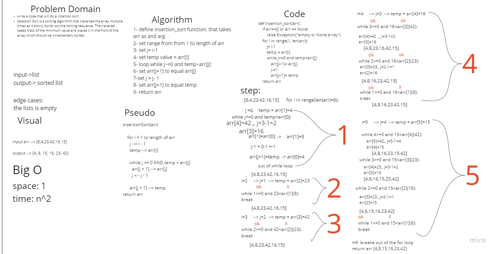

# Blog : Insertion Sort

## Insertion Sort

Insertion Sort is a sorting algorithm that traverses the array multiple times as it slowly builds out the sorting sequence. The traversal keeps track of the minimum value and places it in the front of the array which should be incrementally sorted.

### Summery
in the insertion sort , we will assign a temp value and will change its place to be set as in the order required .


## Code:
```
def insertion_sort(arr):
    if arr==[] or arr == None:
        raise Exception("empty or None array")
    for i in range(1, len(arr)):
        j= i-1
        temp = arr[i]
        while j>=0 and temp<arr[j]:
            arr[j+1]= arr[j]
            j-=1
            arr[j+1]= temp
    return arr

```


## Steps of sorting 

 you can find detailed sorting algorathim in this whiteboard:

 sorting whiteboard 
1. we start with this array and we need to loop to sort it using the code : 
 
     [8,4,23,42,16,15]

2. change the place of the 4 to become in tthe index 0 :

    [4,8,23,42,16,15]

3. in the loop nothing will happen because 23>8:

     [4,8,23,42,16,15]

4. again nothing will change because 42>23

    [4,8,23,42,16,15]

5. will enter the loop and change the place of 15 in several stepes to where it should be :

    [4,8,15,16,23,42]


## Efficency

- Time: O(n^2)


it will take n^2 time, because in the worst case senario it will loop the loop inside the loop for all the elements inside the array


- Space: O(1)

it will not take any additional space as the changing happens in the same array.

