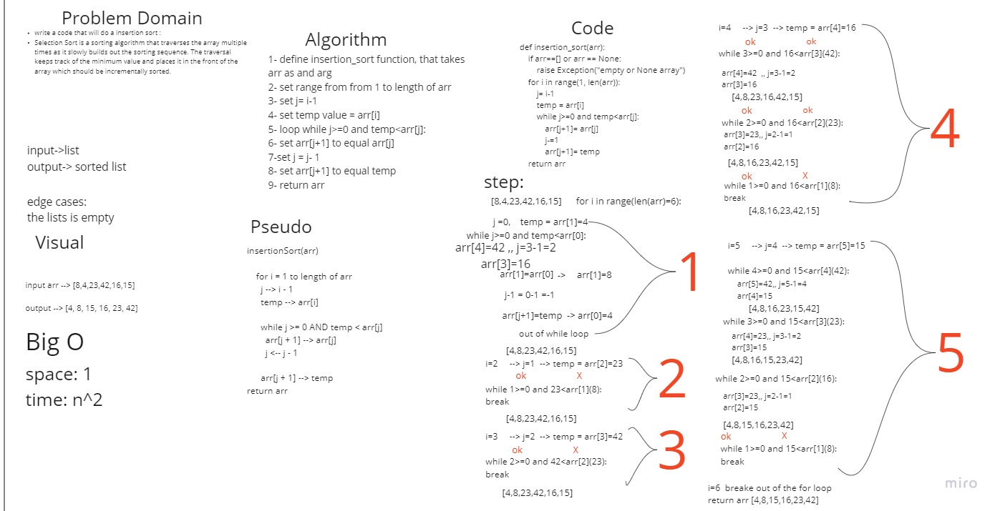

# Challenge Summary
Selection Sort is a sorting algorithm that traverses the array multiple times as it slowly builds out the sorting sequence. The traversal keeps track of the minimum value and places it in the front of the array which should be incrementally sorted

## Whiteboard Process



## Approach & Efficiency
### 
we used the psudocode provided , which gave us the guideline to do this code and whiteboard
### Efficency
Time: O(n^2)
Space: O(1)


## Solution
```
def insertion_sort(arr):
    if arr==[] or arr == None:
        raise Exception("empty or None array")
    for i in range(1, len(arr)):
        j= i-1
        temp = arr[i]
        while j>=0 and temp<arr[j]:
            arr[j+1]= arr[j]
            j-=1
            arr[j+1]= temp
    return arr

```
## Pull Request
https://github.com/SalimHass/blogs/pull/1
