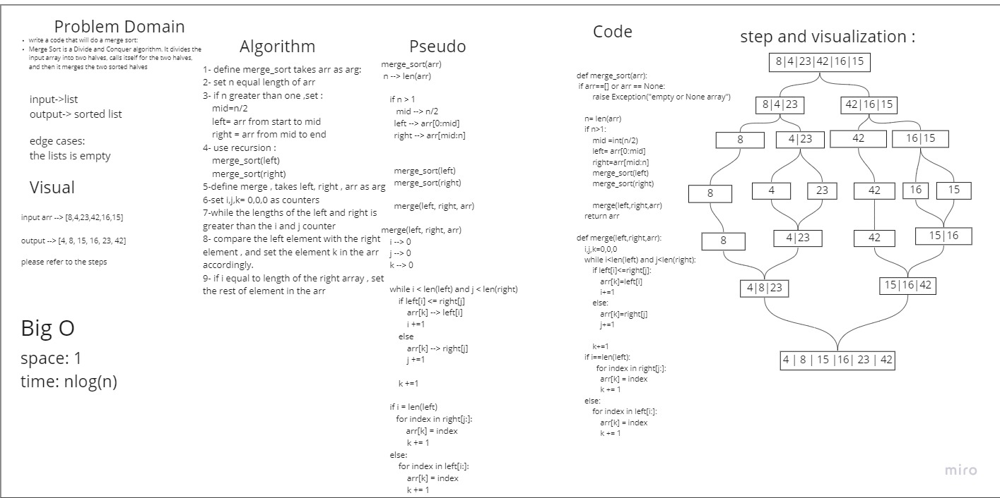

# Blog : Merge Sort

## Merge Sort

Merge sort is one of the most efficient sorting algorithms. It works on the principle of Divide and Conquer. Merge sort repeatedly breaks down a list into several sublists until each sublist consists of a single element and merging those sublists in a manner that results into a sorted list.

### Summery
in the merge sort , we devide the array into smaller arrays , and we remerge them with the elements sorted to form a sorted array.


## Code:
```
def merge_sort(arr):
    if arr==[] or arr == None:
        raise Exception("empty or None array")
    
    n= len(arr)
    if n>1:
        mid =int(n/2)
        left= arr[0:mid]
        right=arr[mid:n]
        merge_sort(left)
        merge_sort(right)

        merge(left,right,arr)
    return arr
    
def merge(left,right,arr):
    i,j,k=0,0,0
    while i<len(left) and j<len(right):
        if left[i]<=right[j]:
            arr[k]=left[i]
            i+=1
        else:
            arr[k]=right[j]
            j+=1

        k+=1
    if i==len(left):
          for index in right[j:]:
            arr[k] = index
            k += 1
    else:
        for index in left[i:]: 
            arr[k] = index
            k += 1

```


## Steps of sorting 

 you can find detailed sorting algorathim in this whiteboard:

 sorting whiteboard 
1. devide the array into left and right: 

    [8,4,23,42,16,15]
 
    [8,4,23] [42,16,15]

2. repeat again recursevly :

    [8] [4,23] [42] [16,15]

    [8] [4] [23] [42] [16] [15]
3. when len is one , remerge the lists according to the numbers 

    [8] [4,23] [42] [15,16]

    [4,8,23] [15,16,42]

    [4,8,15,16,23,42]

    


## Efficency

- Time: O(nlog(n))


- Space: O(1)


