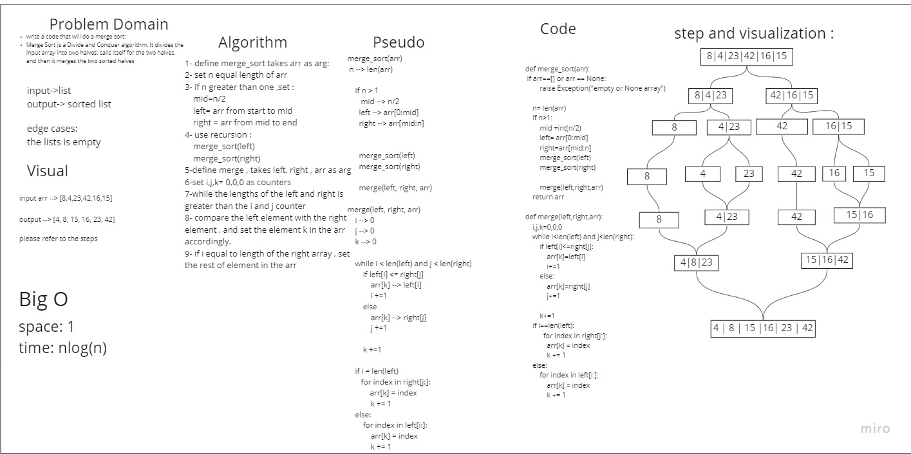

# Challenge Summary
Selection Sort is a sorting algorithm that traverses the array multiple times as it slowly builds out the sorting sequence. The traversal keeps track of the minimum value and places it in the front of the array which should be incrementally sorted

## Whiteboard Process



## Approach & Efficiency
### 
we used merge sort to sort an array. 

Merge sort is one of the most efficient sorting algorithms. It works on the principle of Divide and Conquer. Merge sort repeatedly breaks down a list into several sublists until each sublist consists of a single element and merging those sublists in a manner that results into a sorted list.

### Efficency
Time: O(nlog(n))
Space: O(1)


## Solution
```

def merge_sort(arr):
    if arr==[] or arr == None:
        raise Exception("empty or None array")
    
    n= len(arr)
    if n>1:
        mid =int(n/2)
        left= arr[0:mid]
        right=arr[mid:n]
        merge_sort(left)
        merge_sort(right)

        merge(left,right,arr)
    return arr
    
def merge(left,right,arr):
    i,j,k=0,0,0
    while i<len(left) and j<len(right):
        if left[i]<=right[j]:
            arr[k]=left[i]
            i+=1
        else:
            arr[k]=right[j]
            j+=1

        k+=1
    if i==len(left):
          for index in right[j:]:
            arr[k] = index
            k += 1
    else:
        for index in left[i:]: 
            arr[k] = index
            k += 1


```
## Pull request
https://github.com/SalimHass/blogs/pull/2/

## Blog
[blog](././BLOG.md)
